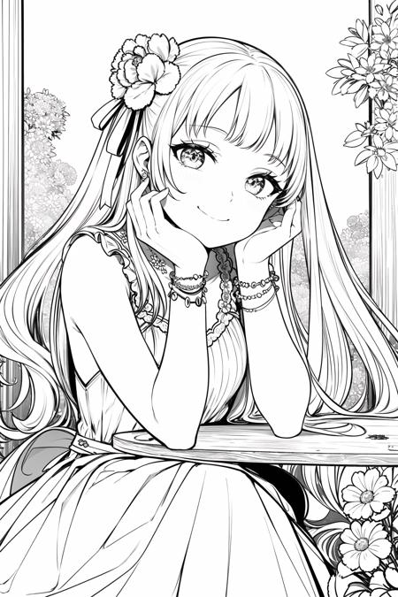
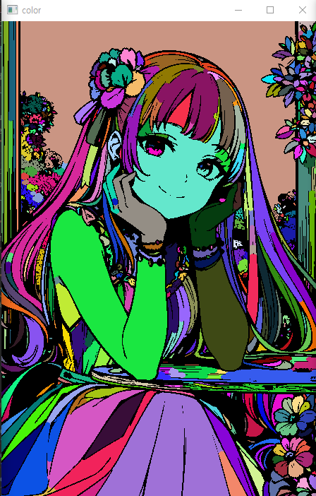
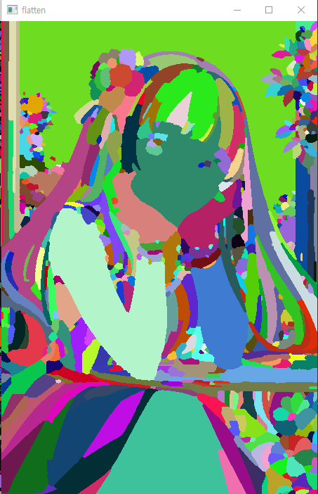

# 🎨 Trapped-ball-Segmentation Filling

    &nbsp&nbsp 
    &nbsp&nbsp 
    

# Summary
선화 이미지에서 영역을 Segmentation 한 후 선화를 지운 Color 이미지를 반환하는 알고리즘 

# Requirements
Python 3.x

``pip install requirements.txt``

# Demo

### 선화

### 채색

### 밑색

  
# Used
``python -m src.TBS``